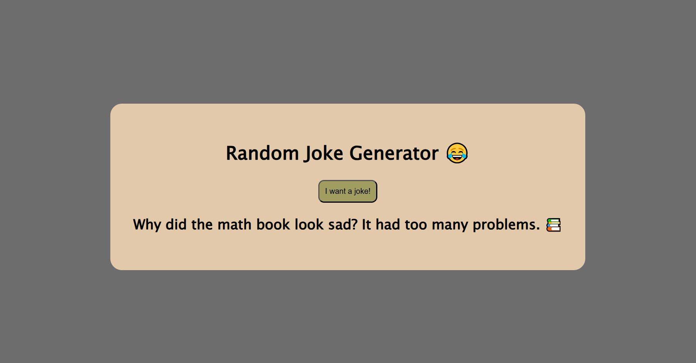

# Random Joke Generator 😂

A simple **JavaScript project** that shows a random joke every time you click the button! Perfect for a quick laugh.



---

## Features

- Click the button to get a random joke 🤣
- Clean and simple design 🎨
- Fun emojis included 🥳
- Fully responsive for desktop & mobile 📱💻

---

## How to Use

1. Clone this repository:

```bash
git clone https://github.com/your-username/random-joke-generator.git
```

2. Open index.html in your browser.

3. Click the "I want a joke!" button and enjoy! 😎

## Live Link

If you want to try out the project, follow this [link](https://faiyaz-xyz.github.io/random-joke-generator/)!

## Tech Used

- HTML5

- CSS3

- JavaScript

## Contribute

Want to add more jokes? Go ahead! Just edit script.js and add your own jokes to the jokes array.

Made with ❤️ by Faiyaz
